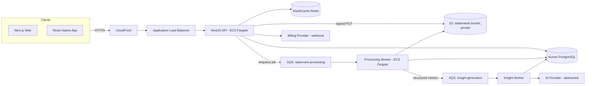
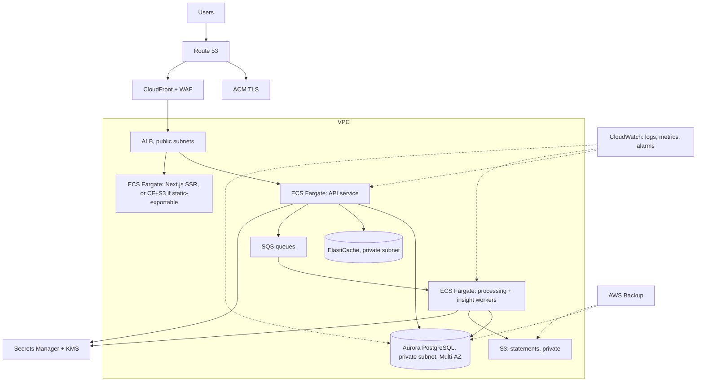

# System & AWS Architecture

## Technology stack (proposed, needs sign-off — see risks doc D-1)

| Layer | Choice | Why |
|---|---|---|
| Mobile | React Native + TypeScript | One codebase for iOS/Android; avoids duplicating financial business logic across two native stacks. Native modules only where required (biometrics, secure storage). |
| Web | Next.js + TypeScript | Server-rendered where it helps SEO/first-load (marketing, auth), client-rendered dashboards; one React skill set shared with mobile devs. |
| Backend | NestJS + TypeScript | Enterprise-grade structure (modules, DI, guards) without the ceremony of a from-scratch Express app; strong typing shared with frontend via a types package. |
| Database | PostgreSQL (Amazon RDS for Aurora PostgreSQL) | Exact NUMERIC types for money, mature transactional guarantees, row-level patterns for tenant isolation. |
| Cache/queue | Redis (ElastiCache) + SQS | SQS for durable async processing jobs (statement pipeline); Redis for hot-path caching (dashboard aggregates, session data). |
| Object storage | Amazon S3 | Private buckets for uploaded statements, signed URLs for controlled access, lifecycle policies for retention. |
| AI | Provider-abstracted (see [07-ai-architecture.md](07-ai-architecture.md)) | Never hard-coupled to one vendor. |

**Architecture style**: modular monolith (NestJS modules with enforced
boundaries: `auth`, `statements`, `transactions`, `categorization`,
`analytics`, `insights`, `billing`, `organizations`, `admin`), not
microservices. Each module owns its own data access and exposes a narrow
internal interface to other modules. This keeps operational complexity low
at current scale while making a future service extraction (e.g. pulling
`statement-processing` out under real load) a refactor, not a rewrite.

## Why not microservices now

Microservices buy independent scaling and deployment at the cost of
distributed-systems complexity (network calls replacing function calls,
eventual consistency, more infrastructure to operate). At an MVP/V1 scale of
zero-to-low-tens-of-thousands of users, that cost isn't justified yet. The
modular monolith is deliberately structured so that the one module most
likely to need independent scaling — statement/document processing — already
runs as separate async workers consuming from SQS, which is the natural seam
if/when it needs to become its own service.

## High-level request flow



## AWS architecture



**Deliberate exclusions at this stage**: no EKS/Kubernetes (Fargate is
sufficient and lower-operational-burden at this scale — revisit only if a
concrete need for multi-cluster orchestration emerges); no multi-region
active-active (single-region with cross-region backup replication is enough
for a Kenya-first product); no API Gateway in front of the ALB (adds cost and
a layer without a clear win over ALB + WAF at this scale).

## Environments

`development` (local docker-compose: Postgres, Redis, LocalStack or MinIO for
S3), `staging` (real AWS, smaller instance sizes, synthetic data only),
`production`. Infrastructure defined once via Terraform modules, parameterized
per environment — no manual console changes to staging/production ever.

## Deployment flow

```
PR opened → CI (lint, typecheck, unit+integration tests, security scan, build)
→ review → merge to main → build images → push to ECR
→ deploy to staging (automatic) → smoke tests
→ deploy to production (manual approval gate) → health checks → rollback on failure
```

Rollback = redeploy previous ECS task definition revision; database
migrations are written to be backward-compatible for at least one release
(expand/contract pattern) so a code rollback never requires a schema rollback.

## Money handling (applies everywhere, not just the DB)

- PostgreSQL: `NUMERIC(14,2)` (or higher precision if a future currency needs
  it) for every monetary column. Never `FLOAT`/`DOUBLE`.
- Application layer: a dedicated `Money` value type wrapping a decimal
  library (e.g. `decimal.js` in TypeScript), arithmetic only through it.
- No monetary total is ever computed by summing formatted display strings or
  trusting a client-submitted total.

## Repository structure (created at Stage 2, not yet)

```
/apps
  /mobile        React Native app
  /web           Next.js app (consumer + business)
  /api           NestJS backend (modular monolith)
  /admin         Internal admin app
/packages
  /ui            Shared design system components
  /types         Shared TypeScript types/DTOs
  /financial     Money type, decimal math, currency formatting
  /validation    Shared zod/class-validator schemas
  /config        Shared env/config loading and validation
/infrastructure  Terraform modules per environment
/docs
/scripts
/tests           Cross-app e2e tests
```

Monorepo (pnpm workspaces + Turborepo, TBD — flagged in risks doc) so
`packages/types` and `packages/financial` are shared verbatim between API,
web, and mobile rather than duplicated.
