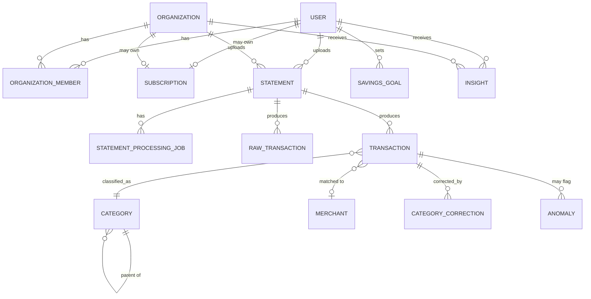

# Domain Model & Entity-Relationship Diagram

## Design rules that shape every table

1. Every organization-owned row carries `organization_id`; every personal row
   carries `user_id`. No table is ever queried without a tenant filter —
   enforced at the repository layer, not just in application logic, and
   verified by dedicated cross-tenant-access tests (see 09, testing strategy).
2. Monetary columns are `NUMERIC(14,2)`, currency-tagged (`currency CHAR(3)`
   default `'KES'`), never `FLOAT`.
3. Raw extracted data is preserved separately from normalized data — a
   `raw_transactions` record is immutable once written; `transactions` is the
   normalized, correctable, analytics-facing table.
4. Every processed statement records the pipeline versions that produced it
   (`parser_version`, `classification_version`, `analytics_version`,
   `insight_version`) for reproducibility and debugging.
5. Soft-delete (`deleted_at`) for anything a deletion workflow or retention
   policy needs to act on asynchronously; hard delete only via an explicit,
   audited purge job.

## Core entities

- **User** — individual account holder. `id, email, password_hash, email_verified_at, created_at, deleted_at`.
- **Organization** — a business tenant. `id, name, plan, created_at, deleted_at`.
- **OrganizationMember** — join table. `id, organization_id, user_id, role (owner|admin|analyst|viewer), invited_at, accepted_at`.
- **Subscription** — billing state for a User or Organization. `id, owner_type (user|organization), owner_id, tier, status, provider_subscription_id, current_period_end`.
- **Statement** — one uploaded document. `id, owner_type, owner_id, s3_key, original_filename, status (uploaded|processing|processed|failed|needs_review), period_start, period_end, document_fingerprint (dedup), parser_version, created_at, deleted_at`.
- **StatementProcessingJob** — one processing attempt. `id, statement_id, stage, started_at, completed_at, error_code, retry_count`.
- **RawTransaction** — immutable, as-extracted. `id, statement_id, raw_row_json, extraction_confidence, created_at`.
- **Transaction** — normalized, analytics-facing. `id, statement_id, owner_type, owner_id, transaction_date, transaction_type, amount, fee, currency, balance_after, description, raw_description, merchant_id, counterparty_id, category_id, subcategory_id, classification_confidence, classification_source, reference_number, is_duplicate_of, created_at, updated_at`.
- **Merchant** — recognized counterparty. `id, canonical_name, default_category_id, source (global|learned)`.
- **Contact** — a person/counterparty for person-to-person transfers. `id, display_name, phone_number_hash, owner_type, owner_id`.
- **Category / Subcategory** — hierarchical taxonomy, versioned. `id, parent_id, name, is_active, version`.
- **CategoryCorrection** — user override. `id, transaction_id, owner_type, owner_id, previous_category_id, new_category_id, created_at`. Scoped to the owner; never mutates global `Merchant.default_category_id` directly (see categorization architecture in 06).
- **SpendingSummary** — precomputed period aggregate (cache, rebuildable from `Transaction`). `id, owner_type, owner_id, period_start, period_end, totals_json, analytics_version`.
- **Insight** — AI-generated, grounded claim. `id, owner_type, owner_id, type, severity, claim_text, supporting_metrics_json, confidence, insight_version, created_at`.
- **SavingsGoal** — `id, owner_id, name, target_amount, target_date, current_amount`.
- **RecurringTransaction** — detected pattern. `id, owner_id, merchant_id, expected_amount, expected_interval_days, last_seen_date`.
- **Anomaly** — flagged unusual transaction. `id, transaction_id, reason, score`.
- **AuditEvent** — `id, actor_user_id, organization_id, action, resource_type, resource_id, metadata_json, created_at`. Append-only.
- **Notification** — `id, user_id, type, payload_json, sent_at, read_at`.

## ERD (core relationships)

## Tenant isolation enforcement

Every repository method that reads or writes `Statement`, `Transaction`,
`SpendingSummary`, `Insight`, etc. takes an authenticated `owner` context
(resolved from the request's auth token, never from a client-supplied body
field) and applies it as a mandatory `WHERE` clause at the query-builder
level — there is no code path that queries these tables without it. This is
the single most safety-critical piece of the schema and gets dedicated
negative-path tests before Stage 12 (business features) ships.

## Open question

Whether tenant isolation is enforced only at the application layer or also
via PostgreSQL Row-Level Security as defense-in-depth is flagged in
[10-risks-and-decisions.md](10-risks-and-decisions.md) (item D-3).
